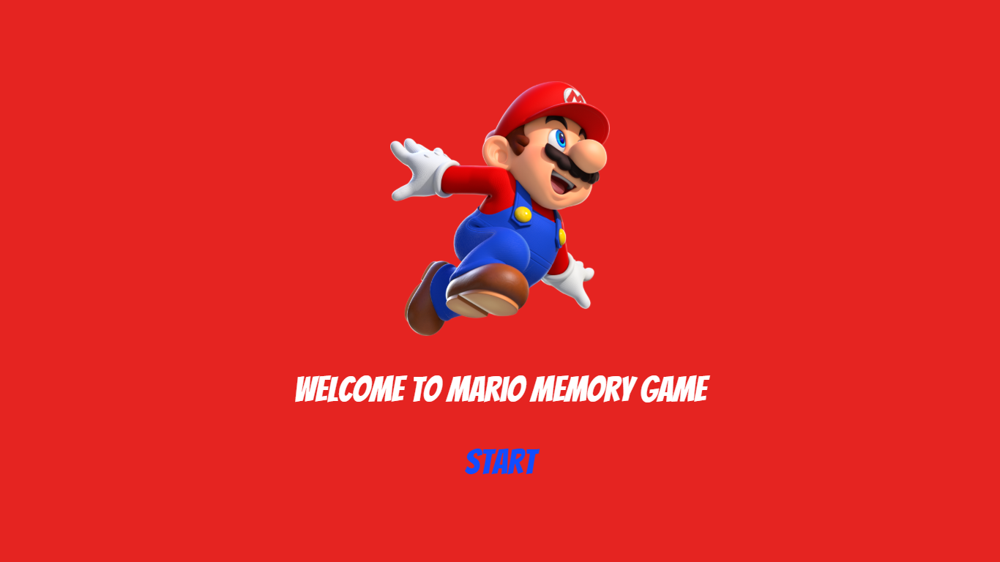
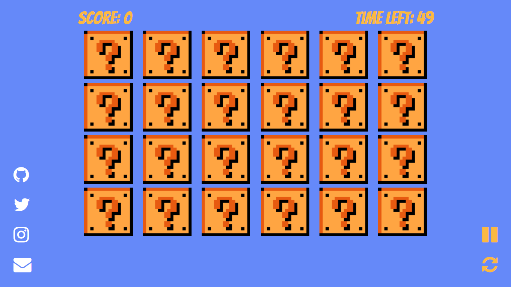
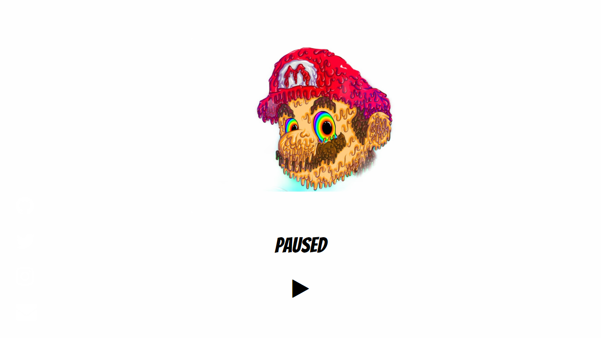
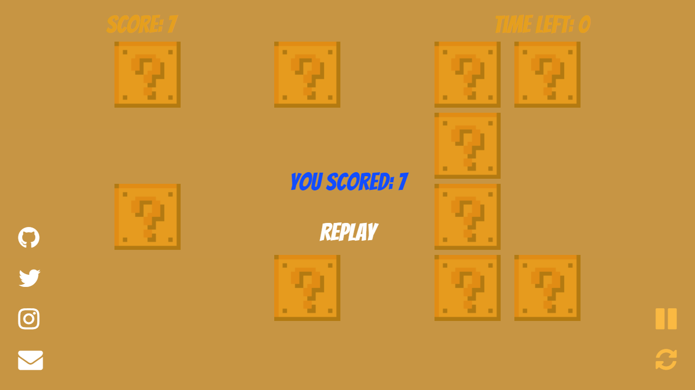
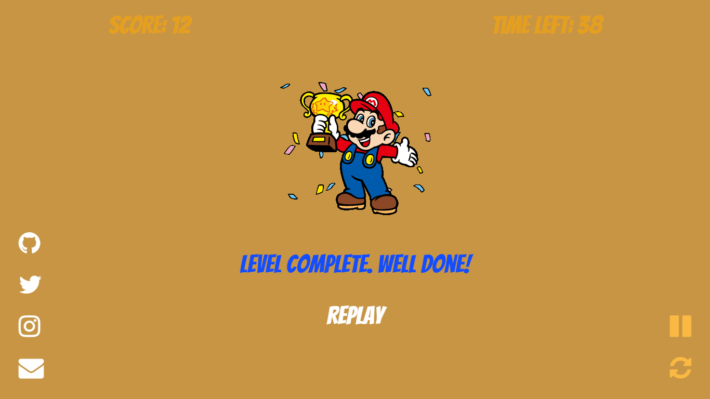

# ⭐ Super Mario Memory Game

  

Fun and simple memory game, like the one from Super Mario 3, made with plain JavaScript.
Inspired by [Tania Rascia](http://taniarascia.github.io/memory). Read the tutorial [here.](https://www.taniarascia.com/how-to-create-a-memory-game-super-mario-with-plain-javascript/)

### [View Demo](https://super-mario.now.sh/)

## Screenshots

### Home

### Gameplay

### Pause Menu

### Game Over

### Winner

## Features

- Sound Effects
- Pause and Play
- Timer

## Projections

- Highscore Board
- Build as Desktop App
- Make Responsive
- More Animations and Transitions

## Author

- [Tania Rascia](https://www.taniarascia.com)
- [Ephraim Atta-Duncan](https://duncann.now.sh)

## License

This project is open source and available under the [MIT License](LICENSE).
